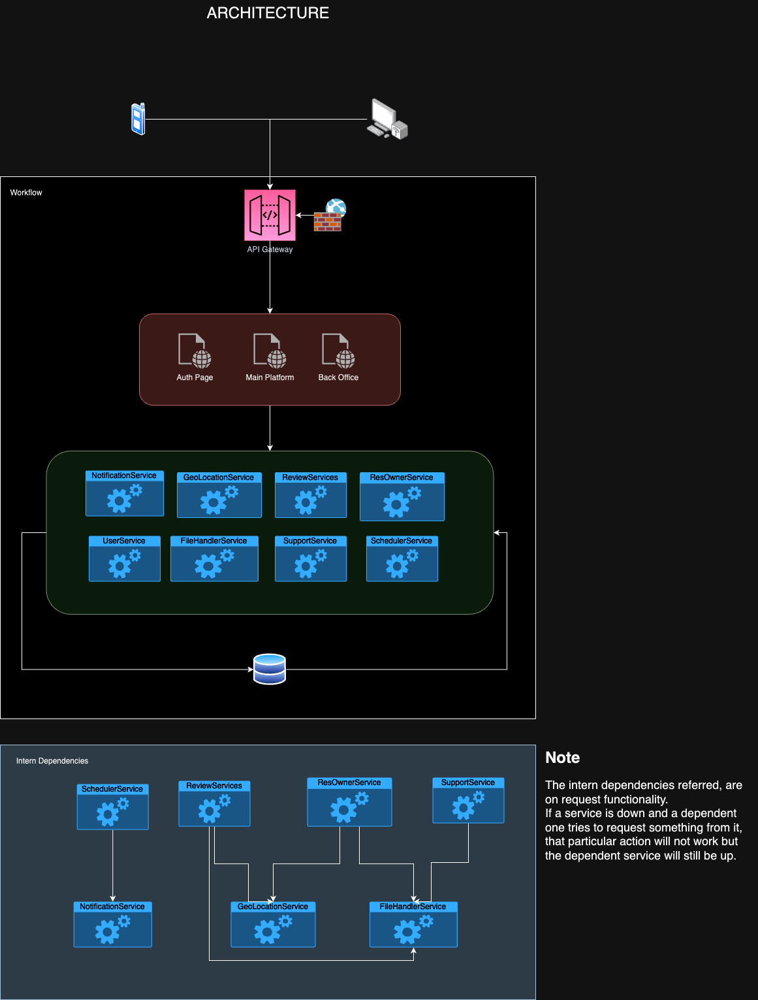

# evaclue

Platform for house rent reviews

## SETUP ENVIRONMENT

- Database:

  - go to Database folder -> open console -> make connection to mysql db (`mysql -u username -p`) -> run .sql file (`source evaclue_db.sql`)
    - some superAdmin type start user is also created
      - email: superAdmin@evaclue.pt
      - pass: diablo4Approach.

- Erase ".template" from "system.config.js.template" and fill missing required parameters.

- Install all dependencies (run commands in the root folder):

  - install packages
    - `npm install`

  - install gulp cli
    - `npm install --global gulp-cli`

  - install packages for all services/views:
    - `gulp build`

  - compile code for all services/views:
    - `gulp compile`

  - install pm2 globaly
    - `npm install pm2 -g`

  - To start Project (will run services and views):
    - `pm2 start system.config.js`

  - To open monitor page of pm2:
    - `pm2 monitor`

## Architecture:

## Versioning

